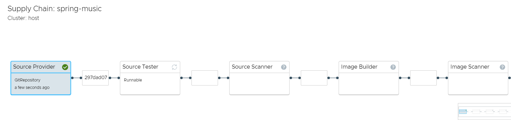
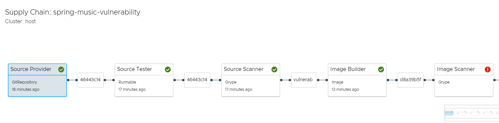

先ほどはLive Update の機能でアプリケーションをデプロイしましたが、今度はtanzu コマンドでデプロイしてみましょう。下記コマンドを入力してみてください。

```execute
tanzu apps workload apply spring-music \
  --app spring-music \
  --git-repo https://github.com/tanzu-japan/spring-music \
  --git-branch tanzu \
  --type web \
  --label apps.tanzu.vmware.com/has-tests=true \
  --annotation autoscaling.knative.dev/minScale=1 \
  -y
```  
このコマンドは少々複雑ですが、オプションとしてgit リポジトリやブランチなどを指定しています。 --annotation autoscaling.knative.dev/minScale=1 の意味は、Knative Serving の最小インスタンス数を1 以上に設定し、時間経過でPod の数が0 になることを防止しています。

--type web はワークロードの種類になります。TAP1.2 ではweb のみサポートしていますが、他にも様々なワークロードのサポートを予定しています。
[https://docs.vmware.com/en/VMware-Tanzu-Application-Platform/1.2/tap/GUID-workloads-workload-types.html](https://docs.vmware.com/en/VMware-Tanzu-Application-Platform/1.2/tap/GUID-workloads-workload-types.html)

最も重要なのは、--label apps.tanzu.vmware.com/has-tests=true です。これは単なるラベルにすぎませんが、どのサプライチェーンを使うかをラベルで表現します。TAP では、ワークロードオブジェクトにつけられたラベルを見て、どのサプライチェーンが使われるかが決まります。ここではapps.tanzu.vmware.com/has-tests=true というラベルを付けていますが、これに対応するサプライチェーンが、この後確認するsource-test-scan-to-url になります。

なお、先ほどのオプション値をworkload.yaml のようにファイルを作成して実行することもできます。

ワークロードの状態を確認し、Ready になるまで数分待ちます。

```execute-2 
tanzu apps workload get spring-music
```

下記のような出力がされます。

```
[~] $ tanzu apps workload get spring-music
# spring-music: Ready

---
lastTransitionTime: "2022-09-27T12:32:34Z"
message: ""
reason: Ready
status: "True"
type: Ready

Pods
NAME                                             STATUS      RESTARTS   AGE
scan-spring-music-6rvjl-lntjm                    Succeeded   0          3m36s
scan-spring-music-s5stf-fwtzc                    Succeeded   0          7m21s
spring-music-00001-deployment-664bfdfddc-8s77h   Running     0          91s
spring-music-build-1-build-pod                   Succeeded   0          6m55s
spring-music-config-writer-bjfcp-pod             Succeeded   0          2m41s
spring-music-qqf7k-test-pod                      Succeeded   0          7m29s

Knative Services
NAME           READY   URL
spring-music   Ready   http://spring-music.tap-demos-w01-s002.app.vpantry.net
```

その間にサプライチェーンがどのような状態になっているか、TAP-GUI を確認してみましょう。

```dashboard:open-url
url: https://tap-gui.{{ ENV_VIEW_CLUSTER_DOMAIN }}/supply-chain
```



source-to-url サプライチェーンと異なり、いくつか追加のステップがあることが分かります。今回はsource-test-scan-to-url サプライチェーンを使いましたが、これは[Tekton](https://tekton.dev/) によるテストや[Grype](https://github.com/anchore/grype) によるイメージスキャンが追加のステップとして定義されている組み込みのサプライチェーンになります。今回はTekton のテストは空ですが、当然カスタマイズすることができます。

このように、サプライチェーンにセキュリティ機能を組み込むことで、より安全なアプリケーションをユーザーに提供することができます。

最後におまけとして、下記も実行してみてください。

```execute
tanzu apps workload apply spring-music-vulnerability \
  --app spring-music-vulnerability \
  --git-repo https://github.com/tanzu-japan/spring-music \
  --git-branch vulnerability-demo \
  --type web \
  --label apps.tanzu.vmware.com/has-tests=true \
  --annotation autoscaling.knative.dev/minScale=1 \
  -y
``` 

こちらは展開が失敗します。イメージに深刻な脆弱性が含まれており、それを検知してデプロイを停止したことになります。もちろん、その後ソースコードを修正すれば、問題なくアプリケーションは展開されます。


